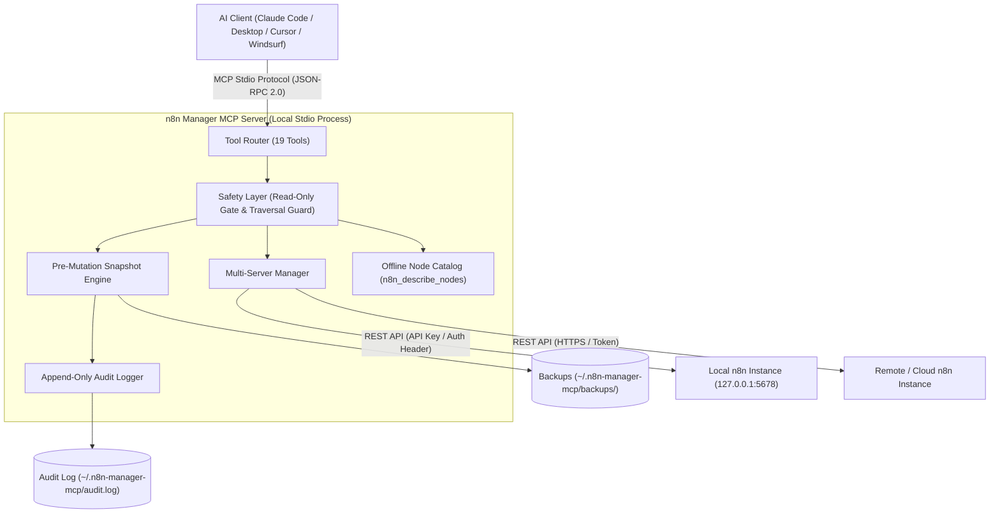
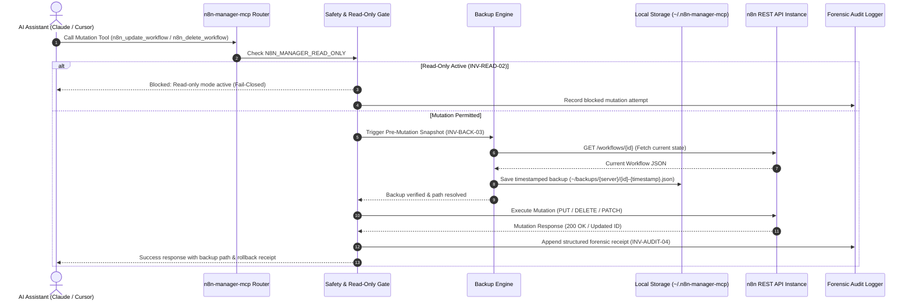

# n8n Manager MCP Server

**🇩🇪 [Deutsche Version](README_de.md)**

*Part of the [ellmos-ai](https://github.com/ellmos-ai) family and [open-bricks](https://github.com/open-bricks) umbrella.*

[](https://www.npmjs.com/package/n8n-manager-mcp)
[](https://github.com/ellmos-ai/n8n-manager-mcp/actions/workflows/tests.yml)
[](https://github.com/ellmos-ai/n8n-manager-mcp)
[](https://nodejs.org)
[](SECURITY.md)
[](SECURITY.md)
[](https://opensource.org/licenses/MIT)
[](llms.txt)
[](https://github.com/ellmos-ai)
[](https://github.com/open-bricks)

> [!NOTE]
> **For AI Assistants & LLMs:** An [`llms.txt`](llms.txt) index file is available in the root directory for fast context ingestion, tool catalog references, and directory listings.

MCP (Model Context Protocol) server for managing n8n workflows via AI assistants like Claude, Cursor, and Windsurf.

## Quick Navigation

- [Overview & Architecture](#system-architecture)
- [Directory Status](#directory-status)
- [Core Capabilities & Safety Invariants](#core-capabilities--safety-invariants)
- [Features](#features)
- [Installation](#installation)
- [Quick Start](#quick-start)
- [Available Tools (19 Tools)](#available-tools)
- [Optional: n8n-workflow-manager Seam](#optional-n8n-workflow-manager-seam)
- [Configuration & Safety Defaults](#configuration)
- [Development & Testing](#development)
- [Sibling Projects & Ecosystem Matrix](#ellmos-ai-ecosystem)
- [Third-Party Licenses & Notices](#third-party-licenses)
- [Changelog](#changelog)
- [Liability & License](#haftung--liability)

## System Architecture

### Component Architecture



### Safe Workflow Mutation Lifecycle



## Directory Status

- [npm package](https://www.npmjs.com/package/n8n-manager-mcp): published as `n8n-manager-mcp`
- [Glama listing](https://glama.ai/mcp/servers/ellmos-ai/n8n-manager-mcp): public directory page for the ellmos-ai repo
- [Enterprise DNA directory](https://enterprisedna.co/directories/mcp/ellmos-ai-n8n-manager-mcp/): additional public directory entry for `ellmos-ai/n8n-manager-mcp`
- [PulseMCP listing](https://www.pulsemcp.com/servers/ellmos-ai-n8n-manager): indexed as `ellmos-ai-n8n-manager`
- MCP namespace status: this repo contains `server.json` and `mcpName` metadata for `io.github.ellmos-ai/n8n-manager-mcp`; some ecosystem directories still expose the legacy `io.github.lukisch/n8n-manager-mcp` name until their indexes refresh.
- Search context: best matched by `n8n MCP server`, `n8n workflow management MCP`, `AI assistant n8n workflows`, and `ellmos-ai n8n-manager-mcp`.

## Core Capabilities & Safety Invariants

| Invariant ID | Capability / Invariant | Technical Guarantee | User Benefit |
| :--- | :--- | :--- | :--- |
| `INV-LOCAL-01` | **100% Local-First & Zero-Egress** | MCP Stdio transport; binds only to `127.0.0.1` by default; no external telemetry | Complete privacy; no workflow logic or credentials ever leave your host |
| `INV-READ-02` | **Monotonic Read-Only Enforcement** | `N8N_MANAGER_READ_ONLY=1` establishes a process-level ceiling immune to tool override | Provable air-gapping against accidental workflow deletions or alterations |
| `INV-BACK-03` | **Automated Pre-Mutation Backups** | Full workflow JSON snapshots stored under `~/.n8n-manager-mcp/backups/` before mutate/delete | Instant 1-click rollback via `n8n_restore_workflow` upon unwanted modifications |
| `INV-AUDIT-04` | **Local Audit Trail** | Append-only structured JSON log in `~/.n8n-manager-mcp/audit.log` | Complete forensic visibility over all agent actions and execution outcomes |
| `INV-SRV-05` | **Multi-Server & Isolated Credentials** | Encrypted/isolated server configs in `servers.json`; API key whitespace validation | Seamless cross-instance workflow migration between staging and production |
| `INV-TRAV-06` | **Strict Input & Path Traversal Guard** | Bounded numeric limits (1..1000), connection indices (0..1000), path escape rejection | Immune to directory traversal, prototype pollution, and malformed payload crashes |
| `INV-PRIV-07` | **Non-Elevation & User-Space Security** | Operates strictly as unprivileged user process | Zero root/administrator privilege requirements for local or CI execution |
| `INV-SEAM-08` | **Opt-In Decision History Seam** | Clean adapter to `n8n-workflow-manager` via `N8N_MCP_MANAGER_URL`; explicit fail-fast | Bridges human decision logs and versioning without corrupting standard MCP mode |
| `INV-NODE-09` | **Built-in Node Catalog & Introspection** | Comprehensive offline catalog for triggers, actions, logic, transform, and AI nodes | LLMs formulate valid node connections without trial-and-error network calls |
| `INV-SLA-10` | **Multi-Node CI & 48h Security SLA** | Automated GitHub Actions CI across Node.js 20, 22 with Concurrency cancellation; 48h response / 5d triage SLA | Guaranteed cross-platform stability, verified security responsiveness, and regression-free distribution |

## Features

- **19 Tools** for complete n8n workflow management
- List, create, update, delete, and activate/deactivate workflows
- Safety controls: read-only mode, backup-before-delete/update, local restore, and audit log
- Multi-server support (connect to multiple n8n instances)
- Export/Import workflows between servers
- View execution history and status
- Built-in node catalog with descriptions
- Zero dependencies on Python -- connects directly to n8n REST API

## Installation

### Claude Desktop

Add to `claude_desktop_config.json`:

```json
{
  "mcpServers": {
    "n8n-manager": {
      "command": "npx",
      "args": ["-y", "n8n-manager-mcp"]
    }
  }
}
```

### Claude Code

```bash
claude mcp add --scope user n8n-manager npx -y n8n-manager-mcp
```

### Manual

```bash
npm install -g n8n-manager-mcp
```

## Quick Start

After installation, use these commands in your AI assistant:

1. **Add your n8n server:**
   > "Add my n8n server at http://localhost:5678 with API key abc123"

2. **List workflows:**
   > "Show me all workflows on my n8n server"

3. **Create a workflow:**
   > "Create an n8n workflow that triggers on a webhook, fetches data from an API, and sends a Slack message"

4. **Check executions:**
   > "Show me the last 10 workflow executions"

## Available Tools

| Tool | Description |
|------|-------------|
| `n8n_list_workflows` | List all workflows on a server |
| `n8n_get_workflow` | Get workflow details (nodes, connections) |
| `n8n_create_workflow` | Create a new workflow from nodes + connections |
| `n8n_update_workflow` | Update an existing workflow |
| `n8n_delete_workflow` | Delete a workflow |
| `n8n_activate_workflow` | Activate or deactivate a workflow |
| `n8n_list_executions` | List recent executions with status |
| `n8n_export_workflow` | Export workflow as importable JSON |
| `n8n_import_workflow` | Import workflow JSON onto a server |
| `n8n_safety_status` | Show local safety settings, backup directory, and audit log path |
| `n8n_set_safety_mode` | Toggle read-only mode, backup-before-mutation, and audit logging |
| `n8n_list_backups` | List local workflow backups created before mutations |
| `n8n_restore_workflow` | Restore a workflow from a local backup |
| `n8n_add_server` | Add/update n8n server connection |
| `n8n_list_servers` | List configured servers |
| `n8n_ping_server` | Test server connection |
| `n8n_remove_server` | Remove a server |
| `n8n_describe_nodes` | Browse available n8n node types |
| `n8n_manager_history` | Read version history, recorded decisions, and sync history from an optional n8n-workflow-manager (opt-in, read-only) |

## Optional: n8n-workflow-manager seam

n8n itself keeps no record of *why* a workflow changed. The sibling project
[n8n-workflow-manager](https://github.com/ellmos-ai/n8n-workflow-manager) does: it
stores versions, a mandatory decision per mutation, and a sync history in a local
database. `n8n_manager_history` makes that record readable from this MCP server.

The seam is **opt-in and read-only**:

- Without `N8N_MCP_MANAGER_URL`, nothing changes — every tool talks to n8n directly, as before.
- With it set (for example `http://127.0.0.1:8100`), `n8n_manager_history` reads from the
  running manager. Omit `workflow_id` to list the manager's workflows, pass it for full history.
- IDs are **manager IDs, not n8n instance IDs**. The manager stores that mapping but exposes
  no route to resolve it, so this server does not guess a translation.
- If the manager is configured but unreachable, the tool **fails with an explicit message**
  instead of quietly answering from the n8n instance — that store has no decision history,
  so a substituted answer would be a different answer.
- `n8n_safety_status` reports the *measured* state of the seam (configured, reachable,
  manager version), not just the environment variable.

Setup: `pip install n8n-workflow-manager`, then `n8n-manager serve` (binds `127.0.0.1:8100`).
The manager API is unauthenticated and loopback-only by design; a non-loopback URL is
flagged in `n8n_safety_status`.

Numeric guardrails are part of the MCP schemas: workflow, execution, and
backup list limits are finite positive integers from **1 to 1000** (the existing
defaults remain 100, 20, and 20), and workflow connection `from_output`/
`to_input` indices are finite non-negative integers from **0 to 1000**. Invalid
values are rejected before any n8n API, filesystem, or workflow-array access.

## Configuration

Server connections and safety settings are stored in `~/.n8n-manager-mcp/servers.json`.

Safety defaults:

- `backup_before_mutations: true` saves workflow JSON before update, delete, activate/deactivate, and overwrite-restore operations.
- `audit_log: true` appends mutation outcomes to `~/.n8n-manager-mcp/audit.log`.
- `read_only: false` can be enabled with `n8n_set_safety_mode` or `N8N_MANAGER_READ_ONLY=1`.
  The environment flag is an enforcement ceiling: while it is enabled,
  persisted settings and `n8n_set_safety_mode` cannot turn read-only mode off.
- Backups are stored under `~/.n8n-manager-mcp/backups/` and can be listed/restored with the backup tools. Server/workflow names are reduced to safe single path segments; reserved names, separators, traversal, and symlink/reparse escapes cannot leave that root, and listing exposes only regular `.json` backups.
- `n8n_add_server` validates server connection input before saving: URLs must be `http` or `https` base URLs without embedded credentials, query strings, or fragments, and API keys must not contain whitespace.
- `n8n_add_server` default semantics are explicit: the first server becomes default; an update without `is_default` preserves the existing flag; `true` promotes the server; `false` intentionally removes its flag, after which default lookup falls back to the first configured server.

## Development

```bash
npm install
npm run build    # One-time build
npm run dev      # Watch mode
npm start        # Start server
npm test         # Run test suite (vitest)
npm run smoke    # Start the built MCP server and verify tool discovery
```

### Testing

The test suite covers URL building, server input validation, server management, safety settings, backup path handling, workflow JSON construction, export/import validation, i18n language packs, repository hygiene, and error handling. The manager seam is tested against a local stub HTTP server, including its refusal to fall back to a direct n8n query.

```bash
npm test              # Run all tests
npx vitest run        # Same as above
npx vitest --watch    # Watch mode
npm run smoke         # Manual stdio MCP smoke test (requires npm run build first)
```

The current verification record covers Windows locally and Ubuntu Linux in GitHub Actions; GitHub Actions runs build, test, and npm package checks on Node.js 20, 22, and 24. The commit-specific local record is kept in `CHANGELOG.md`. The smoke runner starts `dist/index.js` through the MCP SDK client, verifies all 19 tool registrations, and calls the safe `n8n_describe_nodes` catalog tool without requiring n8n credentials.

## Related

- **[n8n-workflow-manager](https://github.com/ellmos-ai/n8n-workflow-manager)** — the **state & history layer for humans** (Web UI + REST API, Python): per-workflow change history and decision log, visual graph viewer, multi-server sync. Designed as a **pair** with this MCP server — the MCP is the **AI action layer** (create/update/delete/activate), the manager is where you review, document, and roll back. **Memory & context (roadmap):** an MCP server alone can't *guarantee* an agent checks prior context before a destructive change — that enforcement belongs in the manager (client-agnostic), with conversational context optionally from a pull-based history index like [ctx](https://github.com/ctxrs/ctx) (Apache-2.0). Planned: a shared history/decision store + a *check-history-before-mutating* guard.
- [n8n](https://n8n.io/) -- The workflow automation platform

## License

MIT

---

## ellmos-ai Ecosystem

This MCP server is part of the **[ellmos-ai](https://github.com/ellmos-ai)** ecosystem — AI infrastructure, MCP servers, and intelligent tools.

### MCP Server Family

| Server | Tools | Focus | npm |
|--------|-------|-------|-----|
| [FileCommander](https://github.com/ellmos-ai/ellmos-filecommander-mcp) | 46 | Filesystem, process management, interactive sessions, cloud-lock-safe operations | [`ellmos-filecommander-mcp`](https://www.npmjs.com/package/ellmos-filecommander-mcp) |
| [CodeCommander](https://github.com/ellmos-ai/ellmos-codecommander-mcp) | 22 | Code analysis, JSON repair, imports, diffs, regex | [`ellmos-codecommander-mcp`](https://www.npmjs.com/package/ellmos-codecommander-mcp) |
| [Clatcher](https://github.com/ellmos-ai/ellmos-clatcher-mcp) | 12 | File repair, format conversion, batch operations | [`ellmos-clatcher-mcp`](https://www.npmjs.com/package/ellmos-clatcher-mcp) |
| **[n8n Manager](https://github.com/ellmos-ai/n8n-manager-mcp)** | **19** | **n8n workflow management via AI assistants** | **[`n8n-manager-mcp`](https://www.npmjs.com/package/n8n-manager-mcp)** |
| [ControlCenter](https://github.com/ellmos-ai/ellmos-controlcenter-mcp) | 20 | MCP stack discovery, profile management, control plane | [`ellmos-controlcenter-mcp`](https://www.npmjs.com/package/ellmos-controlcenter-mcp) |
| [Homebase](https://github.com/ellmos-ai/ellmos-homebase-mcp) | 45 | Local-first LLM memory, knowledge, state, routing, swarm orchestration | [`ellmos-homebase-mcp`](https://www.npmjs.com/package/ellmos-homebase-mcp) (alpha) |
| [ServerCommander](https://github.com/ellmos-ai/ellmos-servercommander-mcp) | 8 | Server operations: health checks, log analysis, deploy dry-runs, mail diagnostics | [`ellmos-servercommander-mcp`](https://www.npmjs.com/package/ellmos-servercommander-mcp) (alpha) |
| [Blender Use](https://github.com/ellmos-ai/ellmos-blender-use-mcp) | 3 | Headless Blender asset QA and FBX reimport verification | [`ellmos-blender-use-mcp`](https://www.npmjs.com/package/ellmos-blender-use-mcp) (alpha) |
| [Open Compute](https://github.com/ellmos-ai/open-compute-mcp) | 10 | Model-agnostic computer use: capture, safety-gated actions, Windows UIA | [`open-compute-mcp`](https://www.npmjs.com/package/open-compute-mcp) (alpha) |

### AI Infrastructure

| Project | Description |
|---------|-------------|
| [BACH](https://github.com/ellmos-ai/bach) | Local-first text-based OS for LLM agents — 113+ handlers, 550+ tools, SQLite memory |
| [open-compute](https://github.com/ellmos-ai/open-compute) | Model-agnostic computer-use core powering Open Compute MCP |
| [clutch](https://github.com/ellmos-ai/clutch) | Provider-neutral LLM orchestration with auto-routing and budget tracking |
| [rinnsal](https://github.com/ellmos-ai/rinnsal) | Lightweight agent memory, connectors, and automation infrastructure |
| [ellmos-stack](https://github.com/ellmos-ai/ellmos-stack) | Self-hosted AI research stack (Ollama + n8n + Rinnsal + KnowledgeDigest) |
| [MarbleRun](https://github.com/ellmos-ai/MarbleRun) | Autonomous agent chain framework for Claude Code |
| [gardener](https://github.com/ellmos-ai/gardener) | Minimalist database-driven LLM OS prototype (4 functions, 1 table) |
| [ellmos-tests](https://github.com/ellmos-ai/ellmos-tests) | Testing framework for LLM operating systems (7 dimensions) |

### Desktop Software & Sibling Tools

Our partner organization **[open-bricks](https://github.com/open-bricks)** and sister suites bundle AI-native desktop applications and developer utilities:

| Repository | Org / Suite | Focus & Functionality |
| :--- | :--- | :--- |
| **[ProFiler](https://github.com/file-bricks/ProFiler)** | `file-bricks` | Advanced file and asset management workbench with duplicate detection |
| **[ExplorerPro](https://github.com/file-bricks/ExplorerPro)** | `file-bricks` | Tabbed, filterable file manager with smart batch processing |
| **[WinStorePackager](https://github.com/file-bricks/WinStorePackager)** | `file-bricks` | MSIX packaging and Windows Store release preparation |
| **[DokuZen](https://github.com/doc-bricks/DokuZen)** | `doc-bricks` | Offline Markdown editor, live preview, and document structuring workbench |
| **[PDFtoPDFocr](https://github.com/doc-bricks/PDFtoPDFocr)** | `doc-bricks` | Offline OCR pipeline converting scanned PDF documents to searchable PDFs |
| **[USR_PDFunlock](https://github.com/doc-bricks/USR_PDFunlock)** | `doc-bricks` | Birthday/date password recovery tool for protected PDF archives |
| **[UniversalInvoiceMail](https://github.com/doc-bricks/UniversalInvoiceMail)** | `doc-bricks` | Automated invoice extraction and email processing |
| **[CleanMarkdown](https://github.com/doc-bricks/CleanMarkdown)** | `doc-bricks` | Lossless formatting and typography cleanup for technical markdown |
| **[safe-start-for-codex](https://github.com/dev-bricks/safe-start-for-codex)** | `dev-bricks` | Fast, reliable agent bootstrap and environment check runner |
| **[automation-master](https://github.com/dev-bricks/automation-master)** | `dev-bricks` | Central multi-host automation orchestrator and task monitor |
| **[DevCenter](https://github.com/dev-bricks/DevCenter)** | `dev-bricks` | Unified developer workspace dashboard for local tool chains |
| **[CodeBox](https://github.com/dev-bricks/CodeBox)** | `dev-bricks` | Sandboxed multi-language tool execution environment |
| **[githubbot](https://github.com/dev-bricks/githubbot)** | `dev-bricks` | Automated multi-org repository maintenance and discoverability engine |
| **[swarm-ai](https://github.com/ellmos-ai/swarm-ai)** | `ellmos-ai` | Distributed multi-agent swarming framework with stigmergic coordination |
| **[ellmos-core](https://github.com/ellmos-ai/ellmos-core)** | `ellmos-ai` | Enterprise AI agent backend, hybrid RAG, and multi-tenant security |
| **[open-bricks](https://github.com/open-bricks)** | `open-bricks` | Umbrella portal and catalog across all local-first AI software products |

## Third-Party Licenses

This project is licensed under the [MIT License](LICENSE).
For a comprehensive inventory of all direct runtime, development, and transitive open-source dependencies along with their respective permissive licenses (MIT, Apache-2.0, BSD-2-Clause, BSD-3-Clause), see [`THIRD_PARTY_LICENSES.md`](THIRD_PARTY_LICENSES.md).

## Marketing & Personas Log

For marketing positioning, target persona definitions, governance invariant mappings, and the 3-phase discoverability roadmap, see [`MARKETING-LOG.txt`](MARKETING-LOG.txt).

## Changelog

See [`CHANGELOG.md`](CHANGELOG.md) for detailed version history, release notes, and past migration milestones.

## Haftung / Liability

Dieses Projekt ist eine **unentgeltliche Open-Source-Schenkung** im Sinne der §§ 516 ff. BGB. Die Haftung des Urhebers ist gemäß **§ 521 BGB** auf **Vorsatz und grobe Fahrlässigkeit** beschränkt. Ergänzend gilt der Haftungsausschluss der MIT-Lizenz.

Nutzung auf eigenes Risiko. Keine Wartungszusage, keine Verfügbarkeitsgarantie, keine Gewähr für Fehlerfreiheit oder Eignung für einen bestimmten Zweck.

This project is an unpaid open-source donation under the MIT License. Liability is limited to intent and gross negligence (§ 521 German Civil Code). Use at your own risk. No warranty, no maintenance guarantee, no fitness-for-purpose assumed.
