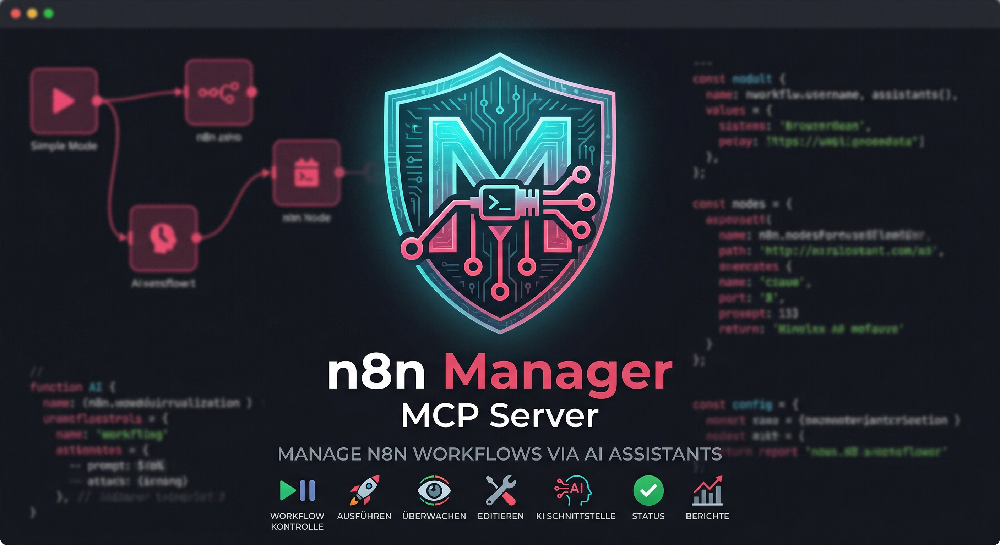

# n8n Manager MCP Server

**🇬🇧 [English Version](README.md)**

*Teil der [ellmos-ai](https://github.com/ellmos-ai)-Familie.*

[](https://www.npmjs.com/package/n8n-manager-mcp)
[](https://opensource.org/licenses/MIT)

MCP-Server (Model Context Protocol) zur Verwaltung von n8n-Workflows über KI-Assistenten wie Claude, Cursor und Windsurf.

## Funktionen

- **13 Tools** für vollständige n8n-Workflow-Verwaltung
- Workflows auflisten, erstellen, aktualisieren, löschen und aktivieren/deaktivieren
- Multi-Server-Unterstützung (Verbindung zu mehreren n8n-Instanzen)
- Export/Import von Workflows zwischen Servern
- Ausführungshistorie und Status einsehen
- Integrierter Node-Katalog mit Beschreibungen
- Keine Python-Abhängigkeiten — direkte Verbindung zur n8n REST API

## Installation

### Claude Desktop

In `claude_desktop_config.json` einfügen:

```json
{
  "mcpServers": {
    "n8n-manager": {
      "command": "npx",
      "args": ["-y", "n8n-manager-mcp"]
    }
  }
}
```

### Claude Code

```bash
claude mcp add --scope user n8n-manager npx -y n8n-manager-mcp
```

### Manuell

```bash
npm install -g n8n-manager-mcp
```

## Schnellstart

Nach der Installation können folgende Befehle im KI-Assistenten verwendet werden:

1. **n8n-Server hinzufügen:**
   > „Füge meinen n8n-Server unter http://localhost:5678 mit API-Key abc123 hinzu"

2. **Workflows auflisten:**
   > „Zeige mir alle Workflows auf meinem n8n-Server"

3. **Workflow erstellen:**
   > „Erstelle einen n8n-Workflow, der bei einem Webhook auslöst, Daten von einer API abruft und eine Slack-Nachricht sendet"

4. **Ausführungen prüfen:**
   > „Zeige mir die letzten 10 Workflow-Ausführungen"

## Verfügbare Tools

| Tool | Beschreibung |
|------|-------------|
| `n8n_list_workflows` | Alle Workflows eines Servers auflisten |
| `n8n_get_workflow` | Workflow-Details abrufen (Nodes, Verbindungen) |
| `n8n_create_workflow` | Neuen Workflow aus Nodes + Verbindungen erstellen |
| `n8n_update_workflow` | Bestehenden Workflow aktualisieren |
| `n8n_delete_workflow` | Workflow löschen |
| `n8n_activate_workflow` | Workflow aktivieren oder deaktivieren |
| `n8n_list_executions` | Letzte Ausführungen mit Status auflisten |
| `n8n_export_workflow` | Workflow als importierbares JSON exportieren |
| `n8n_import_workflow` | Workflow-JSON auf einen Server importieren |
| `n8n_add_server` | n8n-Serververbindung hinzufügen/aktualisieren |
| `n8n_list_servers` | Konfigurierte Server auflisten |
| `n8n_ping_server` | Serververbindung testen |
| `n8n_remove_server` | Server entfernen |
| `n8n_describe_nodes` | Verfügbare n8n-Node-Typen durchsuchen |

## Konfiguration

Serververbindungen werden in `~/.n8n-manager-mcp/servers.json` gespeichert.

## Verwandte Projekte

- [n8n-workflow-manager](https://github.com/ellmos-ai/n8n-workflow-manager) — Vollständige Web-UI + REST API für n8n-Workflow-Verwaltung (Python)
- [n8n](https://n8n.io/) — Die Workflow-Automatisierungsplattform

## Lizenz

MIT

---

## ellmos-ai Ecosystem

This MCP server is part of the **[ellmos-ai](https://github.com/ellmos-ai)** ecosystem — AI infrastructure, MCP servers, and intelligent tools.

### MCP Server Family

| Server | Tools | Focus | npm |
|--------|-------|-------|-----|
| [FileCommander](https://github.com/ellmos-ai/ellmos-filecommander-mcp) | 43 | Filesystem, process management, interactive sessions | `ellmos-filecommander-mcp` |
| [CodeCommander](https://github.com/ellmos-ai/ellmos-codecommander-mcp) | 17 | Code analysis, AST parsing, import management | `ellmos-codecommander-mcp` |
| [Clatcher](https://github.com/ellmos-ai/ellmos-clatcher-mcp) | 12 | File repair, format conversion, batch operations | `ellmos-clatcher-mcp` |
| **[n8n Manager](https://github.com/ellmos-ai/n8n-manager-mcp)** | **13** | **n8n workflow management via AI assistants** | `n8n-manager-mcp` |

### AI Infrastructure

| Project | Description |
|---------|-------------|
| [BACH](https://github.com/ellmos-ai/bach) | Text-based OS for LLMs — 109+ handlers, 373+ tools, 932+ skills |
| [clutch](https://github.com/ellmos-ai/clutch) | Provider-neutral LLM orchestration with auto-routing and budget tracking |
| [rinnsal](https://github.com/ellmos-ai/rinnsal) | Lightweight agent memory, connectors, and automation infrastructure |
| [ellmos-stack](https://github.com/ellmos-ai/ellmos-stack) | Self-hosted AI research stack (Ollama + n8n + Rinnsal + KnowledgeDigest) |
| [MarbleRun](https://github.com/ellmos-ai/MarbleRun) | Autonomous agent chain framework for Claude Code |
| [gardener](https://github.com/ellmos-ai/gardener) | Minimalist database-driven LLM OS prototype (4 functions, 1 table) |
| [ellmos-tests](https://github.com/ellmos-ai/ellmos-tests) | Testing framework for LLM operating systems (7 dimensions) |

### Desktop Software

Our partner organization **[open-bricks](https://github.com/open-bricks)** bundles AI-native desktop applications — a modern, open-source software suite built for the age of AI. Categories include file management, document tools, developer utilities, and more.
