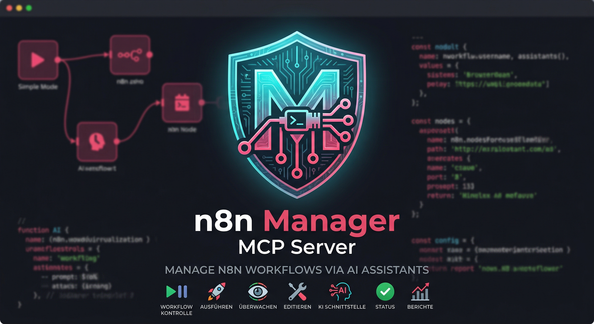

# n8n Manager MCP Server

**🇬🇧 [English Version](README.md)**

*Teil der [ellmos-ai](https://github.com/ellmos-ai)-Familie und des [open-bricks](https://github.com/open-bricks)-Dachverbunds.*

[](https://www.npmjs.com/package/n8n-manager-mcp)
[](https://github.com/ellmos-ai/n8n-manager-mcp/actions/workflows/tests.yml)
[](https://github.com/ellmos-ai/n8n-manager-mcp)
[](https://nodejs.org)
[](SECURITY.md)
[](SECURITY.md)
[](https://opensource.org/licenses/MIT)
[](llms.txt)
[](https://github.com/ellmos-ai)
[](https://github.com/open-bricks)

> [!NOTE]
> **Für KI-Assistenten & LLMs:** Ein [`llms.txt`](llms.txt)-Index steht im Root-Verzeichnis für schnelle Kontext-Erfassung, Werkzeug-Kataloge und Ökosystem-Einstiegspunkte bereit.

MCP-Server (Model Context Protocol) zur Verwaltung von n8n-Workflows über KI-Assistenten wie Claude, Cursor und Windsurf.

## Schnellnavigation

- [Überblick & Architektur](#systemarchitektur)
- [Verzeichnis-Status](#verzeichnis-status)
- [Kernfähigkeiten & Sicherheitsinvarianten](#kernfähigkeiten--sicherheitsinvarianten)
- [Funktionen](#funktionen)
- [Installation](#installation)
- [Schnellstart](#schnellstart)
- [Verfügbare Tools (19 Tools)](#verfügbare-tools)
- [Optional: Anbindung an den n8n-workflow-manager](#optional-anbindung-an-den-n8n-workflow-manager)
- [Konfiguration & Sicherheitsstandard](#konfiguration)
- [Entwicklung & Tests](#entwicklung)
- [Verwandte Projekte](#verwandte-projekte)
- [ellmos-ai-Ökosystem](#ellmos-ai-ökosystem)
- [Haftung & Lizenz](#haftung--liability)

## Systemarchitektur

```mermaid
graph TD
    A["KI-Client (Claude / Cursor / Windsurf)"] -->|MCP-Stdio-Protokoll| B["n8n Manager MCP Server"]
    subgraph "n8n Manager MCP Server"
        B --> C["Werkzeug-Router (19 Tools)"]
        C --> D["Sicherheitsschicht (Read-Only / Backups / Audit)"]
        C --> E["Multi-Server-Verwaltung"]
    end
    E -->|REST API (API Key / Basic Auth)| F["n8n-Instanz 1 (Lokal)"]
    E -->|REST API (API Key / Basic Auth)| G["n8n-Instanz 2 (Cloud / Remote)"]
    D --> H[("Lokaler Speicher (~/.n8n-manager-mcp/)")]
```

## Verzeichnis-Status

- [npm-Paket](https://www.npmjs.com/package/n8n-manager-mcp): veröffentlicht als `n8n-manager-mcp`
- [Glama-Eintrag](https://glama.ai/mcp/servers/ellmos-ai/n8n-manager-mcp): öffentliche Verzeichnisseite für das ellmos-ai-Repo
- [Enterprise-DNA-Verzeichnis](https://enterprisedna.co/directories/mcp/ellmos-ai-n8n-manager-mcp/): zusätzlicher öffentlicher Verzeichniseintrag für `ellmos-ai/n8n-manager-mcp`
- [PulseMCP-Eintrag](https://www.pulsemcp.com/servers/ellmos-ai-n8n-manager): indexiert als `ellmos-ai-n8n-manager`
- MCP-Namespace-Status: Dieses Repo enthält `server.json` und `mcpName`-Metadaten für `io.github.ellmos-ai/n8n-manager-mcp`; einzelne Ökosystem-Verzeichnisse zeigen bis zur Index-Aktualisierung noch den älteren Namen `io.github.lukisch/n8n-manager-mcp`.
- Suchkontext: am besten auffindbar über `n8n MCP server`, `n8n workflow management MCP`, `AI assistant n8n workflows` und `ellmos-ai n8n-manager-mcp`.

## Kernfähigkeiten & Sicherheitsinvarianten

| Fähigkeit / Invariante | Technische Garantie | Anwendervorteil |
| :--- | :--- | :--- |
| **100% Local-First & Zero-Egress** | MCP-Stdio-Transport; standardmäßig nur an `127.0.0.1` gebunden; keine externe Telemetrie | Vollständige Privatsphäre; keine Workflow-Logik oder Zugangsdaten verlassen das lokale System |
| **Monotones Read-Only-Schutzgating** | `N8N_MANAGER_READ_ONLY=1` erzwingt eine prozessweite Obergrenze gegen Werkzeug-Overrides | Verlässlicher Schutz gegen versehentliches Löschen oder Ändern kritischer Produktions-Workflows |
| **Automatische Pre-Mutation-Backups** | Vollständige JSON-Snapshots unter `~/.n8n-manager-mcp/backups/` vor Update/Löschen | 1-Klick-Wiederherstellung über `n8n_restore_workflow` nach Fehlern oder ungewollten Änderungen |
| **Lokale Audit-Protokollierung** | Strukturierter JSON-Audit-Trail im Append-Only-Format unter `~/.n8n-manager-mcp/audit.log` | Lückenlose forensische Nachvollziehbarkeit aller Agentenaktionen und Ausführungsergebnisse |
| **Multi-Server & Zugangsdaten-Isolation** | Isolierte Server-Konfigurationen in `servers.json`; API-Key-Whitespace-Validierung | Mühelose Workflow-Migration zwischen Entwicklungs-, Staging- und Produktiv-Instanzen |
| **Strikte Eingabe- & Pfadtraversal-Sperre** | Feste Limits (1..1000), Verbindungsindizes (0..1000), Abweisung von Pfadausbrüchen | Resistent gegen Directory-Traversal-Angriffe, Prototype-Pollution und fehlerhafte Payloads |
| **Non-Elevation & User-Space-Sicherheit** | Ausführung ausschließlich im unprivilegierten Benutzerkontext | Keine Administrator- oder Root-Rechte für lokalen Betrieb oder CI-Pipelines erforderlich |
| **Opt-In Decision-History-Seam** | Sauberer Adapter zu `n8n-workflow-manager` via `N8N_MCP_MANAGER_URL`; explizites Fail-Fast | Verbindet menschliche Entscheidungsdokumentation mit MCP ohne Seiteneffekte im Standardmodus |
| **Integrierter Node-Katalog & Introspektion** | Umfassender Offline-Katalog für Trigger-, Action-, Logic-, Transform- und KI-Nodes | LLMs generieren valide Node-Verbindungen ohne zeitraubende API-Netzwerk-Trial-and-Error-Aufrufe |
| **Multi-Node & Multi-OS CI-Matrix** | Automatisierte GitHub Actions CI auf Node.js 20, 22 mit Concurrency-Abbruch | Garantiert dauerhafte Plattformstabilität und regressionsfreie Verteilbarkeit |

## Funktionen

- **19 Tools** für vollständige n8n-Workflow-Verwaltung
- Workflows auflisten, erstellen, aktualisieren, löschen und aktivieren/deaktivieren
- Sicherheitsfunktionen: Read-only-Modus, Backup vor Löschen/Aktualisieren, lokale Wiederherstellung und Audit-Log
- Multi-Server-Unterstützung (Verbindung zu mehreren n8n-Instanzen)
- Export/Import von Workflows zwischen Servern
- Ausführungshistorie und Status einsehen
- Integrierter Node-Katalog mit Beschreibungen
- Keine Python-Abhängigkeiten — direkte Verbindung zur n8n REST API

## Installation

### Claude Desktop

In `claude_desktop_config.json` einfügen:

```json
{
  "mcpServers": {
    "n8n-manager": {
      "command": "npx",
      "args": ["-y", "n8n-manager-mcp"]
    }
  }
}
```

### Claude Code

```bash
claude mcp add --scope user n8n-manager npx -y n8n-manager-mcp
```

### Manuell

```bash
npm install -g n8n-manager-mcp
```

## Schnellstart

Nach der Installation können folgende Befehle im KI-Assistenten verwendet werden:

1. **n8n-Server hinzufügen:**
   > „Füge meinen n8n-Server unter http://localhost:5678 mit API-Key abc123 hinzu"

2. **Workflows auflisten:**
   > „Zeige mir alle Workflows auf meinem n8n-Server"

3. **Workflow erstellen:**
   > „Erstelle einen n8n-Workflow, der bei einem Webhook auslöst, Daten von einer API abruft und eine Slack-Nachricht sendet"

4. **Ausführungen prüfen:**
   > „Zeige mir die letzten 10 Workflow-Ausführungen"

## Verfügbare Tools

| Tool | Beschreibung |
|------|-------------|
| `n8n_list_workflows` | Alle Workflows eines Servers auflisten |
| `n8n_get_workflow` | Workflow-Details abrufen (Nodes, Verbindungen) |
| `n8n_create_workflow` | Neuen Workflow aus Nodes + Verbindungen erstellen |
| `n8n_update_workflow` | Bestehenden Workflow aktualisieren |
| `n8n_delete_workflow` | Workflow löschen |
| `n8n_activate_workflow` | Workflow aktivieren oder deaktivieren |
| `n8n_list_executions` | Letzte Ausführungen mit Status auflisten |
| `n8n_export_workflow` | Workflow als importierbares JSON exportieren |
| `n8n_import_workflow` | Workflow-JSON auf einen Server importieren |
| `n8n_safety_status` | Lokale Sicherheitseinstellungen, Backup-Ordner und Audit-Log-Pfad anzeigen |
| `n8n_set_safety_mode` | Read-only-Modus, Backup vor Änderungen und Audit-Logging umschalten |
| `n8n_list_backups` | Lokale Workflow-Backups auflisten |
| `n8n_restore_workflow` | Workflow aus einem lokalen Backup wiederherstellen |
| `n8n_add_server` | n8n-Serververbindung hinzufügen/aktualisieren |
| `n8n_list_servers` | Konfigurierte Server auflisten |
| `n8n_ping_server` | Serververbindung testen |
| `n8n_remove_server` | Server entfernen |
| `n8n_describe_nodes` | Verfügbare n8n-Node-Typen durchsuchen |
| `n8n_manager_history` | Versionshistorie, protokollierte Entscheidungen und Sync-Historie aus einem optionalen n8n-workflow-manager lesen (opt-in, nur lesend) |

## Optional: Anbindung an den n8n-workflow-manager

n8n selbst hält nicht fest, *warum* ein Workflow geändert wurde. Das Schwesterprojekt
[n8n-workflow-manager](https://github.com/ellmos-ai/n8n-workflow-manager) tut genau das:
Es speichert Versionen, eine verpflichtende Entscheidung je Änderung und eine
Sync-Historie in einer lokalen Datenbank. `n8n_manager_history` macht diesen Bestand
aus diesem MCP-Server lesbar.

Die Anbindung ist **opt-in und nur lesend**:

- Ohne `N8N_MCP_MANAGER_URL` ändert sich nichts — jedes Tool spricht wie bisher direkt mit n8n.
- Ist sie gesetzt (etwa `http://127.0.0.1:8100`), liest `n8n_manager_history` aus dem laufenden
  Manager. Ohne `workflow_id` listet das Tool dessen Workflows, mit `workflow_id` zeigt es die
  vollständige Historie.
- Die IDs sind **Manager-IDs, keine n8n-Instanz-IDs**. Der Manager speichert diese Zuordnung,
  stellt aber keine Route zum Auflösen bereit — dieser Server rät deshalb keine Übersetzung.
- Ist der Manager konfiguriert, aber nicht erreichbar, **scheitert das Tool mit klarer Meldung**,
  statt still aus der n8n-Instanz zu antworten: Dort gibt es keine Entscheidungshistorie, eine
  ersatzweise Antwort wäre also eine andere Antwort.
- `n8n_safety_status` meldet den **gemessenen** Zustand der Anbindung (konfiguriert, erreichbar,
  Manager-Version) — nicht bloß die gesetzte Umgebungsvariable.

Einrichtung: `pip install n8n-workflow-manager`, dann `n8n-manager serve` (bindet an
`127.0.0.1:8100`). Die Manager-API ist bewusst unauthentifiziert und nur über Loopback
erreichbar; eine Nicht-Loopback-URL wird in `n8n_safety_status` ausdrücklich angemerkt.

Numerische Leitplanken sind Teil der MCP-Schemas: Listenlimits für Workflows,
Ausführungen und Backups sind endliche positive Ganzzahlen von **1 bis 1000**
(die bisherigen Defaults bleiben 100, 20 und 20), und die Workflow-Verbindungs-
indizes `from_output`/`to_input` sind endliche nichtnegative Ganzzahlen von
**0 bis 1000**. Ungültige Werte werden vor API-, Dateisystem- oder
Workflow-Array-Zugriffen abgewiesen.

## Konfiguration

Serververbindungen und Sicherheitseinstellungen werden in `~/.n8n-manager-mcp/servers.json` gespeichert.

Sicherheitsstandard:

- `backup_before_mutations: true` speichert Workflow-JSON vor Aktualisieren, Löschen, Aktivieren/Deaktivieren und überschreibender Wiederherstellung.
- `audit_log: true` schreibt Ergebnisse von Änderungen nach `~/.n8n-manager-mcp/audit.log`.
- `read_only: false` kann mit `n8n_set_safety_mode` oder `N8N_MANAGER_READ_ONLY=1` aktiviert werden.
  Die Umgebungsvariable ist eine verbindliche Obergrenze: Solange sie aktiv ist,
  können weder gespeicherte Einstellungen noch `n8n_set_safety_mode` den Lesemodus ausschalten.
- Backups liegen unter `~/.n8n-manager-mcp/backups/` und können mit den Backup-Tools aufgelistet oder wiederhergestellt werden. Server-/Workflow-Namen werden auf sichere einzelne Pfadsegmente reduziert; reservierte Namen, Separatoren, Traversal sowie Symlink-/Reparse-Ausbrüche verlassen dieses Root nicht, und die Liste zeigt nur reguläre `.json`-Backups.
- `n8n_add_server` validiert Serververbindungen vor dem Speichern: URLs müssen `http`- oder `https`-Basis-URLs ohne eingebettete Zugangsdaten, Query-Strings oder Fragmente sein; API-Keys dürfen keine Whitespaces enthalten.
- Die Default-Semantik von `n8n_add_server` ist explizit: Der erste Server wird Default; ein Update ohne `is_default` bewahrt das bisherige Flag; `true` macht den Server zum Default; `false` entfernt sein Flag absichtlich, danach fällt die Default-Suche auf den ersten konfigurierten Server zurück.

## Entwicklung

```bash
npm install
npm run build    # Einmaliger Build
npm run dev      # Watch-Modus
npm start        # Server starten
npm test         # Tests ausführen (vitest)
npm run smoke    # Gebauten MCP-Server starten und Tool-Discovery prüfen
```

### Tests

Die Test-Suite deckt die Kernlogik aller 19 Tools, Server-Eingabevalidierung, i18n-Sprachpakete, Repository-Hygiene und Fehlerbehandlung ab. Die Manager-Anbindung wird gegen einen lokalen Stub-HTTP-Server geprüft — einschließlich ihrer Weigerung, ersatzweise direkt n8n abzufragen.

```bash
npm test              # Alle Tests ausführen
npx vitest run        # Gleiche Funktion
npx vitest --watch    # Watch-Modus
npm run smoke         # Manueller stdio-MCP-Smoke-Test (vorher npm run build)
```

Der aktuelle Verifikationsbeleg umfasst lokale Tests unter Windows und Ubuntu Linux in GitHub Actions; GitHub Actions führt Build, Tests und npm-Paketprüfung auf Node.js 20, 22 und 24 aus. Der commitbezogene lokale Beleg steht in `CHANGELOG.md`. Der Smoke-Runner startet `dist/index.js` über den MCP-SDK-Client, prüft alle 19 Tool-Registrierungen und ruft das sichere Katalog-Tool `n8n_describe_nodes` ohne n8n-Zugangsdaten auf.

## Verwandte Projekte

- **[n8n-workflow-manager](https://github.com/ellmos-ai/n8n-workflow-manager)** — die **Zustands- und Verlaufsschicht für Menschen** (Web-UI + REST API, Python): Versionshistorie und Entscheidungs-Log pro Workflow, visueller Graph-Viewer, Multi-Server-Sync. Als **Paar** mit diesem MCP-Server gedacht — der MCP ist die **KI-Aktionsschicht** (erstellen/aktualisieren/löschen/aktivieren), der Manager ist der Ort zum Prüfen, Dokumentieren und Zurückrollen. **Gedächtnis & Kontext (Roadmap):** ein MCP-Server allein kann nicht *garantieren*, dass ein Agent vor einer destruktiven Änderung den vorhandenen Kontext prüft — diese Durchsetzung gehört in den Manager (client-unabhängig), konversationeller Kontext optional aus einem pull-basierten Verlaufsindex wie [ctx](https://github.com/ctxrs/ctx) (Apache-2.0). Geplant: ein gemeinsamer Verlaufs-/Entscheidungsspeicher + ein *Verlauf-vor-Änderung-prüfen*-Guard.
- [n8n](https://n8n.io/) — Die Workflow-Automatisierungsplattform

## Lizenz

MIT

---

## ellmos-ai-Ökosystem

Dieser MCP-Server ist Teil des **[ellmos-ai](https://github.com/ellmos-ai)**-Ökosystems — KI-Infrastruktur, MCP-Server und intelligente Werkzeuge.

### MCP-Server-Familie

| Server | Tools | Fokus | npm |
|--------|-------|-------|-----|
| [FileCommander](https://github.com/ellmos-ai/ellmos-filecommander-mcp) | 46 | Dateisystem, Prozessverwaltung, interaktive Sitzungen, Cloud-Lock-sichere Operationen | [`ellmos-filecommander-mcp`](https://www.npmjs.com/package/ellmos-filecommander-mcp) |
| [CodeCommander](https://github.com/ellmos-ai/ellmos-codecommander-mcp) | 22 | Code-Analyse, JSON-Reparatur, Imports, Diffs, Regex | [`ellmos-codecommander-mcp`](https://www.npmjs.com/package/ellmos-codecommander-mcp) |
| [Clatcher](https://github.com/ellmos-ai/ellmos-clatcher-mcp) | 12 | Dateireparatur, Formatkonvertierung, Batch-Operationen | [`ellmos-clatcher-mcp`](https://www.npmjs.com/package/ellmos-clatcher-mcp) |
| **[n8n Manager](https://github.com/ellmos-ai/n8n-manager-mcp)** | **19** | **n8n-Workflow-Verwaltung über KI-Assistenten** | **[`n8n-manager-mcp`](https://www.npmjs.com/package/n8n-manager-mcp)** |
| [ControlCenter](https://github.com/ellmos-ai/ellmos-controlcenter-mcp) | 20 | MCP-Stack-Discovery, Profilverwaltung, Control Plane | [`ellmos-controlcenter-mcp`](https://www.npmjs.com/package/ellmos-controlcenter-mcp) |
| [Homebase](https://github.com/ellmos-ai/ellmos-homebase-mcp) | 45 | Local-first LLM-Gedächtnis, Wissen, Zustand, Routing, Schwarm-Orchestrierung | [`ellmos-homebase-mcp`](https://www.npmjs.com/package/ellmos-homebase-mcp) (alpha) |
| [ServerCommander](https://github.com/ellmos-ai/ellmos-servercommander-mcp) | 8 | Server-Operationen: Health-Checks, Log-Analyse, Deploy-Dry-Runs, Mail-Diagnose | [`ellmos-servercommander-mcp`](https://www.npmjs.com/package/ellmos-servercommander-mcp) (alpha) |
| [Blender Use](https://github.com/ellmos-ai/ellmos-blender-use-mcp) | 3 | Headless Blender-Asset-QA und FBX-Reimport-Verifikation | [`ellmos-blender-use-mcp`](https://www.npmjs.com/package/ellmos-blender-use-mcp) (alpha) |
| [Open Compute](https://github.com/ellmos-ai/open-compute-mcp) | 10 | Modell-agnostischer Computer-Use: Capture, safety-gated Aktionen, Windows-UIA | [`open-compute-mcp`](https://www.npmjs.com/package/open-compute-mcp) (alpha) |

### KI-Infrastruktur

| Projekt | Beschreibung |
|---------|-------------|
| [BACH](https://github.com/ellmos-ai/bach) | Local-first textbasiertes OS für LLM-Agenten — 113+ Handler, 550+ Tools, SQLite-Memory |
| [open-compute](https://github.com/ellmos-ai/open-compute) | Modell-agnostischer Computer-Use-Kern hinter Open Compute MCP |
| [clutch](https://github.com/ellmos-ai/clutch) | Provider-neutrale LLM-Orchestrierung mit Auto-Routing und Budget-Tracking |
| [rinnsal](https://github.com/ellmos-ai/rinnsal) | Leichte Agent-Memory-, Connector- und Automatisierungsinfrastruktur |
| [ellmos-stack](https://github.com/ellmos-ai/ellmos-stack) | Self-hosted AI Research Stack (Ollama + n8n + Rinnsal + KnowledgeDigest) |
| [MarbleRun](https://github.com/ellmos-ai/MarbleRun) | Autonomes Agent-Chain-Framework für Claude Code |
| [gardener](https://github.com/ellmos-ai/gardener) | Minimalistischer datenbankgetriebener LLM-OS-Prototyp (4 Funktionen, 1 Tabelle) |
| [ellmos-tests](https://github.com/ellmos-ai/ellmos-tests) | Testframework für LLM-Betriebssysteme (7 Dimensionen) |

### Desktop-Software & Geschwisterwerkzeuge

Unsere Partnerorganisation **[open-bricks](https://github.com/open-bricks)** und Partnersuiten bündeln KI-native Desktop-Anwendungen und Entwicklerwerkzeuge:

| Repository | Org / Suite | Fokus & Kernfunktionalität |
| :--- | :--- | :--- |
| **[ProFiler](https://github.com/file-bricks/ProFiler)** | `file-bricks` | Erweiterte Datei- und Asset-Management-Werkbank mit Duplikaterkennung |
| **[ExplorerPro](https://github.com/file-bricks/ExplorerPro)** | `file-bricks` | Moderner Mehr-Reiter-Dateimanager mit flexibler Stapelverarbeitung |
| **[WinStorePackager](https://github.com/file-bricks/WinStorePackager)** | `file-bricks` | MSIX-Paketierung und Microsoft Store Release-Vorbereitung |
| **[DokuZen](https://github.com/doc-bricks/DokuZen)** | `doc-bricks` | Offline-Markdown-Editor, Live-Vorschau und Dokument-Strukturierung |
| **[PDFtoPDFocr](https://github.com/doc-bricks/PDFtoPDFocr)** | `doc-bricks` | Lokale OCR-Pipeline zur Umwandlung gescannter PDFs in durchsuchbare Dokumente |
| **[USR_PDFunlock](https://github.com/doc-bricks/USR_PDFunlock)** | `doc-bricks` | Geburtstags- und Datums-Passwortwiederherstellung für PDF-Archive |
| **[UniversalInvoiceMail](https://github.com/doc-bricks/UniversalInvoiceMail)** | `doc-bricks` | Automatisierte Rechnungsextraktion und E-Mail-Verarbeitung |
| **[CleanMarkdown](https://github.com/doc-bricks/CleanMarkdown)** | `doc-bricks` | Verlustfreie Formatierungs- und Typographie-Bereinigung für Markdown |
| **[safe-start-for-codex](https://github.com/dev-bricks/safe-start-for-codex)** | `dev-bricks` | Schneller und robuster Agent-Bootstrap mit Umgebungsvalidierung |
| **[automation-master](https://github.com/dev-bricks/automation-master)** | `dev-bricks` | Zentrale Multi-Host-Automationsorchestrierung und Aufgabenüberwachung |
| **[DevCenter](https://github.com/dev-bricks/DevCenter)** | `dev-bricks` | Zentrales Entwickler-Dashboard für lokale Software-Ökosysteme |
| **[CodeBox](https://github.com/dev-bricks/CodeBox)** | `dev-bricks` | Isolierte mehrsprachige Werkzeug- und Codeausführungsumgebung |
| **[githubbot](https://github.com/dev-bricks/githubbot)** | `dev-bricks` | Automatisierte Multi-Org-Repository-Wartungs- und Discoverability-Engine |
| **[swarm-ai](https://github.com/ellmos-ai/swarm-ai)** | `ellmos-ai` | Verteiltes Multi-Agenten-Schwarm-Framework mit Stigmergie-Koordination |
| **[ellmos-core](https://github.com/ellmos-ai/ellmos-core)** | `ellmos-ai` | Enterprise KI-Agenten-Backend, hybrides RAG und mandantenfähige Sicherheit |
| **[open-bricks](https://github.com/open-bricks)** | `open-bricks` | Dachportal und Katalog für alle lokalen KI-Softwareprodukte |

## Haftung / Liability

Dieses Projekt ist eine **unentgeltliche Open-Source-Schenkung** im Sinne der §§ 516 ff. BGB. Die Haftung des Urhebers ist gemäß **§ 521 BGB** auf **Vorsatz und grobe Fahrlässigkeit** beschränkt. Ergänzend gilt der Haftungsausschluss der MIT-Lizenz.

Nutzung auf eigenes Risiko. Keine Wartungszusage, keine Verfügbarkeitsgarantie, keine Gewähr für Fehlerfreiheit oder Eignung für einen bestimmten Zweck.

This project is an unpaid open-source donation under the MIT License. Liability is limited to intent and gross negligence (§ 521 German Civil Code). Use at your own risk. No warranty, no maintenance guarantee, no fitness-for-purpose assumed.
