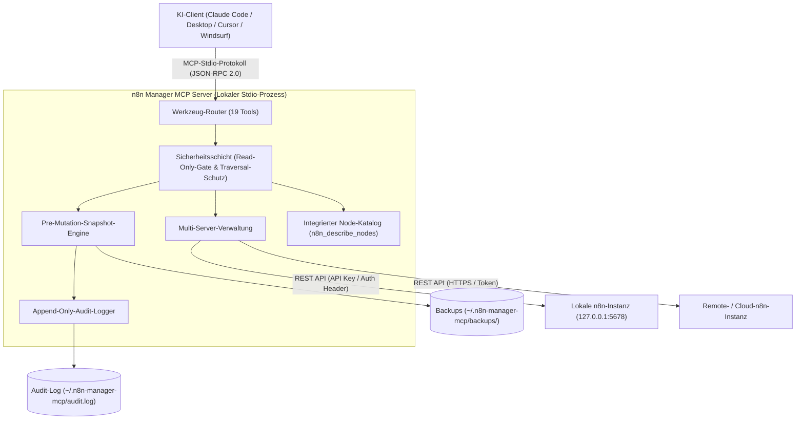
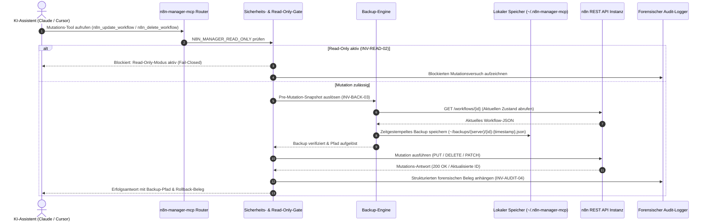

# n8n Manager MCP Server

**🇬🇧 [English Version](README.md)**

*Teil der [ellmos-ai](https://github.com/ellmos-ai)-Familie und des [open-bricks](https://github.com/open-bricks)-Dachverbunds.*

[](https://www.npmjs.com/package/n8n-manager-mcp)
[](https://github.com/ellmos-ai/n8n-manager-mcp/actions/workflows/tests.yml)
[](https://github.com/ellmos-ai/n8n-manager-mcp)
[](https://nodejs.org)
[](SECURITY.md)
[](SECURITY.md)
[](THIRD_PARTY_LICENSES.md)
[](NOTICE)
[](llms.txt)
[](llms.txt)
[](https://opensource.org/licenses/MIT)
[](llms.txt)
[](https://github.com/ellmos-ai)
[](https://github.com/open-bricks)

> [!NOTE]
> **Für KI-Assistenten & LLMs:** Ein [`llms.txt`](llms.txt)-Index steht im Root-Verzeichnis für schnelle Kontext-Erfassung, Werkzeug-Kataloge und Ökosystem-Einstiegspunkte bereit.

MCP-Server (Model Context Protocol) zur Verwaltung von n8n-Workflows über KI-Assistenten wie Claude, Cursor und Windsurf.

## Schnellnavigation

| Nr | Abschnitt | Kerninhalte |
| :--- | :--- | :--- |
| 01 | [📐 Systemarchitektur & Topologie](#sec-01) ([#systemarchitektur](#systemarchitektur)) | Lokaler Stdio-Transport, Multi-Server-Routing und Sicherheits-Middleware |
| 02 | [📊 Duale Mermaid-Diagramme](#sec-02) ([#duale-mermaid-diagramme](#duale-mermaid-diagramme)) | Komponenten-Flowchart TD & Sicherer Mutations-Lebenszyklus im Sequenzdiagramm |
| 03 | [🌐 Verzeichnis-Status & Registries](#sec-03) ([#verzeichnis-status](#verzeichnis-status)) | Offizielle Einträge auf npm, Glama, PulseMCP und Enterprise DNA |
| 04 | [🎯 Zielgruppen & Auffindbarkeit](#sec-04) ([#zielgruppen--auffindbarkeit](#zielgruppen--auffindbarkeit)) | Persona-Mapping `[PERSONA-01]` bis `[PERSONA-04]` und High-Intent-Suchbegriffe |
| 05 | [⚖️ Vergleichsmatrix & Alternativen](#sec-05) ([#vergleichsmatrix--alternativen](#vergleichsmatrix--alternativen)) | 10-Dimensionen-Vergleich vs direkte REST-API, Shell-CLI, Web-UI und Cloud-SaaS |
| 06 | [🛡️ Kernfähigkeiten & Sicherheitsinvarianten](#sec-06) ([#kernfähigkeiten--sicherheitsinvarianten](#kernfähigkeiten--sicherheitsinvarianten)) | 10 formale Invarianten (`INV-LOCAL-01` bis `INV-SLA-10`), Read-Only-Gates, Audit-Logs |
| 07 | [✨ Funktionen](#sec-07) ([#funktionen](#funktionen)) | Direkte REST-Anbindung, Multi-Server-Routing, Backup-Snapshots, Node-Katalog |
| 08 | [⚙️ Installation](#sec-08) ([#installation](#installation)) | Ein-Befehl-Einrichtung für Claude Code, Claude Desktop, Cursor und Windsurf |
| 09 | [🚀 Schnellstart](#sec-09) ([#schnellstart](#schnellstart)) | Schrittweise Workflow-Erstellung, Ausführungsinspektion und Server-Wechsel |
| 10 | [🛠️ Verfügbare Tools (19 Tools)](#sec-10) ([#verfügbare-tools](#verfügbare-tools)) | Vollständige MCP-Tool-Referenz für CRUD, Ausführungen, Backups und Nodes |
| 11 | [🔗 Optional: Anbindung an den n8n-workflow-manager](#sec-11) ([#optional-anbindung-an-den-n8n-workflow-manager](#optional-anbindung-an-den-n8n-workflow-manager)) | Entscheidungsdokumentation und Versionsverlauf über gekoppeltes Manager-Modul |
| 12 | [🔒 Konfiguration & Sicherheits-Standards](#sec-12) ([#konfiguration](#konfiguration)) | Umgebungsvariablen, lokales Backup-Wurzelverzeichnis und monotone Schranken |
| 13 | [🧪 Entwicklung & Tests](#sec-13) ([#entwicklung](#entwicklung)) | Multi-OS Vitest Testsuite, Smoke-Runner und Offline-Node-Katalog-Tests |
| 14 | [🧱 ellmos-ai Ökosystem](#sec-14) ([#ellmos-ai-ökosystem](#ellmos-ai-ökosystem)) | Geschwister-MCP-Server, BACH Agenten-OS und open-bricks Desktop-Suiten |
| 15 | [📜 Drittanbieter-Lizenzen & Transparenz](#sec-15) ([#drittanbieter-lizenzen--transparenz](#drittanbieter-lizenzen--transparenz)) | 100% permissive Open-Source-Abhängigkeiten (MIT, BSD, Apache-2.0) |
| 16 | [📈 Marketing- & Zielgruppen-Log](#sec-16) ([#marketing--personas-protokoll](#marketing--personas-protokoll)) | Umfassendes Positionierungs-Log, Keyword-Matrix und 3-Phasen-Roadmap |
| 17 | [📝 Änderungsprotokoll](#sec-17) ([#änderungsprotokoll](#änderungsprotokoll)) | Vollständige Release-Notizen, Sicherheitshärtungen und Discoverability-Historie |
| 18 | [⚖️ Haftung & Gesetzlicher Hinweis (§ 521 BGB)](#sec-18) ([#haftung--liability](#haftung--liability)) | Schenkungsklausel nach §§ 516 ff. BGB, MIT-Haftungsausschluss, 48h SLA |

---

<a id="sec-01"></a>
<a id="1-architektur"></a>
<a id="1-architecture"></a>
<a id="systemarchitektur"></a>
<a id="system-architecture"></a>
## Systemarchitektur

Der n8n Manager MCP Server fungiert als **lokale, über Standard-Ein-/Ausgabe (stdio) angebundene Brücke** zwischen modernen KI-Entwicklungsumgebungen (Claude Code, Claude Desktop, Cursor, Windsurf) und lokalen oder cloudbasierten n8n-Instanzen.

- **Prozessmodell:** Läuft vollständig im unprivilegierten Benutzerkontext (`RunAsInvoker`) als dedizierter Node.js-Kindprozess über Standard-Ein-/Ausgabe (`stdio`) mit JSON-RPC 2.0.
- **Fail-Closed Sicherheits-Middleware:** Jede zustandsverändernde Aktion durchläuft vor dem API-Kontakt eine monotone Schranke (`N8N_MANAGER_READ_ONLY=1`).
- **Multi-Instanzen-Router:** Ermöglicht die flexible Adressierung getrennter Umgebungen (Entwicklung, Staging, Produktion) mit isolierten API-Keys und atomarer Speicherung (`servers.json`).
- **Integrierter Node-Katalog:** Bietet Offline-Introspektion von Node-Typen und Schemas (`n8n_describe_nodes`) ohne Netzwerklatenz.

---

<a id="sec-02"></a>
<a id="2-duale-mermaid-diagramme"></a>
<a id="2-dual-mermaid-diagrams"></a>
<a id="duale-mermaid-diagramme"></a>
<a id="dual-mermaid-diagrams"></a>
## Duale Mermaid-Diagramme

### Komponenten-Architektur


```mermaid
flowchart TD
    Client["KI-Client (Claude Code / Desktop / Cursor / Windsurf)"] -->|"MCP-Stdio-Protokoll (JSON-RPC 2.0)"| Router["Werkzeug-Router (19 Tools)"]
    subgraph MCPServer["n8n Manager MCP Server (Lokaler Stdio-Prozess)"]
        Router --> Safety["Sicherheitsschicht (Read-Only-Gate & Traversal-Schutz)"]
        Safety --> Backup["Pre-Mutation-Snapshot-Engine"]
        Safety --> MultiServer["Multi-Server-Verwaltung"]
        Safety --> Catalog["Integrierter Node-Katalog (n8n_describe_nodes)"]
        Backup --> Audit["Append-Only-Audit-Logger"]
    end
    MultiServer -->|"REST API (API Key / Auth Header)"| LocalInst["Lokale n8n-Instanz (127.0.0.1:5678)"]
    MultiServer -->|"REST API (HTTPS / Token)"| CloudInst["Remote- / Cloud-n8n-Instanz"]
    Backup --> BackupFS[("Backups (~/.n8n-manager-mcp/backups/)")]
    Audit --> AuditFS[("Audit-Log (~/.n8n-manager-mcp/audit.log)")]
```

### Sicherer Workflow-Mutations-Lebenszyklus


```mermaid
sequenceDiagram
    autonumber
    actor AI as KI-Assistent (Claude / Cursor)
    participant MCP as n8n-manager-mcp Router
    participant Safety as Sicherheits- & Read-Only-Gate
    participant Snapshot as Backup-Engine
    participant Store as Lokaler Speicher (~/.n8n-manager-mcp)
    participant N8N as n8n REST API Instanz
    participant Audit as Forensischer Audit-Logger

    AI->>MCP: Mutations-Tool aufrufen (n8n_update_workflow / n8n_delete_workflow)
    MCP->>Safety: N8N_MANAGER_READ_ONLY prüfen
    alt Read-Only aktiv (INV-READ-02)
        Safety-->>AI: Blockiert: Read-Only-Modus aktiv (Fail-Closed)
        Safety->>Audit: Blockierten Mutationsversuch aufzeichnen
    else Mutation zulässig
        Safety->>Snapshot: Pre-Mutation-Snapshot auslösen (INV-BACK-03)
        Snapshot->>N8N: GET /workflows/{id} (Aktuellen Zustand abrufen)
        N8N-->>Snapshot: Aktuelles Workflow-JSON
        Snapshot->>Store: Zeitgestempeltes Backup speichern (~/backups/{server}/{id}-{timestamp}.json)
        Snapshot-->>Safety: Backup verifiziert & Pfad aufgelöst
        Safety->>N8N: Mutation ausführen (PUT / DELETE / PATCH)
        N8N-->>Safety: Mutations-Antwort (200 OK / Aktualisierte ID)
        Safety->>Audit: Strukturierten forensischen Beleg anhängen (INV-AUDIT-04)
        Safety-->>AI: Erfolgsantwort mit Backup-Pfad & Rollback-Beleg
    end
```

---

<a id="sec-03"></a>
<a id="3-verzeichnis-status"></a>
<a id="3-directory-status"></a>
<a id="verzeichnis-status"></a>
<a id="directory-status"></a>
## Verzeichnis-Status

- [npm-Paket](https://www.npmjs.com/package/n8n-manager-mcp): veröffentlicht als `n8n-manager-mcp`
- [Glama-Eintrag](https://glama.ai/mcp/servers/ellmos-ai/n8n-manager-mcp): öffentliche Verzeichnisseite für das ellmos-ai-Repo
- [Enterprise-DNA-Verzeichnis](https://enterprisedna.co/directories/mcp/ellmos-ai-n8n-manager-mcp/): zusätzlicher öffentlicher Verzeichniseintrag für `ellmos-ai/n8n-manager-mcp`
- [PulseMCP-Eintrag](https://www.pulsemcp.com/servers/ellmos-ai-n8n-manager): indexiert als `ellmos-ai-n8n-manager`
- MCP-Namespace-Status: Dieses Repo enthält `server.json` und `mcpName`-Metadaten für `io.github.ellmos-ai/n8n-manager-mcp`; einzelne Ökosystem-Verzeichnisse zeigen bis zur Index-Aktualisierung noch den älteren Namen `io.github.lukisch/n8n-manager-mcp`.
- Suchkontext: am besten auffindbar über `n8n MCP server`, `n8n workflow management MCP`, `AI assistant n8n workflows` und `ellmos-ai n8n-manager-mcp`.

---

<a id="sec-04"></a>
<a id="4-zielgruppen--auffindbarkeit"></a>
<a id="4-target-personas--discoverability"></a>
<a id="zielgruppen--auffindbarkeit"></a>
<a id="target-personas--discoverability"></a>
## Zielgruppen & Auffindbarkeit

| Zielgruppe / Persona | Kernbedürfnisse | Gelöste Probleme | Zentrale Suchbegriffe |
| :--- | :--- | :--- | :--- |
| **[PERSONA-01] Autonome KI-Agenten & Schwärme** | Zerstörungsfreie Workflow-Steuerung, Pre-Mutation-Snapshots, deterministische Belege | LLM-Halluzinationen beschädigen aktive Workflows; kein Offline-Node-Graph einsehbar | `n8n mcp server`, `ai agent n8n workflow management`, `claude code n8n automation` |
| **[PERSONA-02] DevOps & Multi-Environment-Architekten** | Sicheres Multi-Server-Routing, Export/Import-Synchronisation über Stages | Manuelle JSON-Export-Reibung; Staging-zu-Produktions-Drift; unversionierte Workflow-Kopien | `n8n multi-server mcp`, `sync n8n workflows staging prod`, `n8n workflow export import mcp` |
| **[PERSONA-03] SecOps, Compliance & Risikoteams** | Monotone Read-Only-Sperren, lokale Audit-Trails, Zero-External-Egress | Unregulierte Agenten-Mutationen; ungesicherte API-Aufrufe; Verlust forensischer Historie | `safe n8n mcp server`, `read-only n8n automation`, `audit log n8n ai integration` |
| **[PERSONA-04] Ökosystem-Entwickler & Tool-Integratoren** | Standardisierte MCP-Schemas, validierte Manifeste, robuste TypeScript-SDK-Anbindung | Schema-Diskrepanzen in MCP-Verzeichnissen; fehlende Regressions- und Vertragstests | `modelcontextprotocol n8n`, `glama n8n-manager-mcp`, `smithery n8n workflow` |

### Suchbegriffe mit hoher Absicht (High-Intent SEO)

- `n8n mcp server ki assistenten`
- `claude code n8n workflow steuerung`
- `lokaler n8n mcp stdio transport`
- `sichere n8n workflow mutation mit backup`
- `n8n multi-server synchronisation mcp`
- `n8n offline node katalog ai agents`
- `zero-egress n8n automatisierung datenschutz`
- `modelcontextprotocol n8n typescript integration`

---

<a id="sec-05"></a>
<a id="5-vergleichsmatrix--alternativen"></a>
<a id="5-comparative-matrix--alternatives"></a>
<a id="vergleichsmatrix--alternativen"></a>
<a id="comparative-matrix--alternatives"></a>
## Vergleichsmatrix & Alternativen

| Dimension | `n8n-manager-mcp` | Direkte n8n REST API | Standard Agent Shell | Manuelle n8n Web-UI | Generische Cloud-SaaS |
| :--- | :--- | :--- | :--- | :--- | :--- |
| **Primäre Schnittstelle** | Natives MCP Stdio (JSON-RPC) | Reines HTTP REST (Curl/Axios) | Ad-hoc CLI / Bash-Skripte | Interaktive Browser-Canvas | Proprietäres Webportal |
| **Sicherheits-Leitplanken** | Monotones Read-Only-Gate (`N8N_MANAGER_READ_ONLY=1`) | Keine (Ungeprüfte API-Aufrufe) | Shell-Exit-Code-Heuristik | Menschliche Bestätigungsdialoge | Remote Rollenregeln (RBAC) |
| **Mutations-Backups** | Automatische Pre-Mutation-Snapshots (`INV-BACK-03`) | Keine (Überschreibt Live-System) | Keine (Skriptabhängig) | Keine (Direkte Canvas-Änderung) | Anbieterabhängige Snapshots |
| **Rollback-Fähigkeit** | 1-Klick `n8n_restore_workflow` von lokaler Platte | Manuelle JSON-Rekonstruktion | Eigene Rollback-Skripte nötig | Manuelles Neuerstellen von Nodes | Anbieter-Rollback (Kostenpflichtig) |
| **Forensisches Audit-Log** | Strukturiertes Append-Only `audit.log` (`INV-AUDIT-04`) | Standard-Webserver-Access-Logs | Flüchtige Terminal-Ausgabe | Nur grafische Ausführungshistorie | Cloud-Hersteller-Logaufbewahrung |
| **Node-Introspektion** | Integrierter Offline-Katalog (`n8n_describe_nodes`) | Manuelle Onlinedokumentation | Raten & Parameter-Ausprobieren | Visuelle Node-Palette | Online-Entwicklerportal |
| **Multi-Server-Isolation** | Isolierte Profile (`servers.json`) | Manuelles Token-Wechseln | Shell-History-Token-Lecks | Multi-Tab-Login-Durcheinander | Cloud-Workspace-Umschaltung |
| **Privatsphäre & Zero-Egress**| 100% lokaler Stdio-Transport, Zero Telemetrie | Direkter HTTP-Client-Verkehr | Lokale Shell-Ausführung | Browser-Tracking & Analytik | Remote Drittanbieter-Hosting |
| **Workflow-Migration** | Integrierte Tools `n8n_export_workflow` & `import` | Eigene Python/Curl-Pipelines | Komplexe bash/jq-Skripte | Manueller Download/Upload-Dialog | Cloud-Enterprise-Bezahlschranke |
| **Lizenz & Auditsicherheit** | 100% Permissiv MIT (Geprüft, 48h SLA) | Fair-Code (n8n Quellcode verfügbar) | Gemischte / Ad-hoc Lizenzen | Kommerziell / Fair-Code | Proprietäre geschlossene Cloud |

---

<a id="sec-06"></a>
<a id="6-kernfaehigkeiten--sicherheitsinvarianten"></a>
<a id="6-core-capabilities--safety-invariants"></a>
<a id="kernfähigkeiten--sicherheitsinvarianten"></a>
<a id="core-capabilities--safety-invariants"></a>
## Kernfähigkeiten & Sicherheitsinvarianten

| Invarianten-ID | Fähigkeit / Invariante | Technische Garantie | Anwendervorteil |
| :--- | :--- | :--- | :--- |
| `INV-LOCAL-01` | **100% Local-First & Zero-Egress** | MCP-Stdio-Transport; standardmäßig nur an `127.0.0.1` gebunden; keine externe Telemetrie | Vollständige Privatsphäre; keine Workflow-Logik oder Zugangsdaten verlassen das lokale System |
| `INV-READ-02` | **Monotones Read-Only-Schutzgating** | `N8N_MANAGER_READ_ONLY=1` erzwingt eine prozessweite Obergrenze gegen Werkzeug-Overrides | Verlässlicher Schutz gegen versehentliches Löschen oder Ändern kritischer Produktions-Workflows |
| `INV-BACK-03` | **Automatische Pre-Mutation-Backups** | Vollständige JSON-Snapshots unter `~/.n8n-manager-mcp/backups/` vor Update/Löschen | 1-Klick-Wiederherstellung über `n8n_restore_workflow` nach Fehlern oder ungewollten Änderungen |
| `INV-AUDIT-04` | **Lokale Audit-Protokollierung** | Strukturierter JSON-Audit-Trail im Append-Only-Format unter `~/.n8n-manager-mcp/audit.log` | Lückenlose forensische Nachvollziehbarkeit aller Agentenaktionen und Ausführungsergebnisse |
| `INV-SRV-05` | **Multi-Server & Zugangsdaten-Isolation** | Isolierte Server-Konfigurationen in `servers.json`; API-Key-Whitespace-Validierung | Mühelose Workflow-Migration zwischen Entwicklungs-, Staging- und Produktiv-Instanzen |
| `INV-TRAV-06` | **Strikte Eingabe- & Pfadtraversal-Sperre** | Feste Limits (1..1000), Verbindungsindizes (0..1000), Abweisung von Pfadausbrüchen | Resistent gegen Directory-Traversal-Angriffe, Prototype-Pollution und fehlerhafte Payloads |
| `INV-PRIV-07` | **Non-Elevation & User-Space-Sicherheit** | Ausführung ausschließlich im unprivilegierten Benutzerkontext | Keine Administrator- oder Root-Rechte für lokalen Betrieb oder CI-Pipelines erforderlich |
| `INV-SEAM-08` | **Opt-In Decision-History-Seam** | Sauberer Adapter zu `n8n-workflow-manager` via `N8N_MCP_MANAGER_URL`; explizites Fail-Fast | Verbindet menschliche Entscheidungsdokumentation mit MCP ohne Seiteneffekte im Standardmodus |
| `INV-NODE-09` | **Integrierter Node-Katalog & Introspektion** | Umfassender Offline-Katalog für Trigger-, Action-, Logic-, Transform- und KI-Nodes | LLMs generieren valide Node-Verbindungen ohne zeitraubende API-Netzwerk-Trial-and-Error-Aufrufe |
| `INV-SLA-10` | **Multi-Node CI & 48h Sicherheits-SLA** | Automatisierte GitHub Actions CI auf Node.js 20, 22 mit Concurrency-Abbruch; 48h Antwort- / 5-Tage-Triage-Zusage | Garantiert dauerhafte Plattformstabilität, verifizierte Sicherheits-Reaktionszeit und regressionsfreie Verteilbarkeit |

<a id="sec-07"></a>
<a id="7-funktionen"></a>
<a id="7-features"></a>
<a id="funktionen"></a>
<a id="features"></a>
## Funktionen

- **19 Tools** für vollständige n8n-Workflow-Verwaltung
- Workflows auflisten, erstellen, aktualisieren, löschen und aktivieren/deaktivieren
- Sicherheitskontrollen: Read-Only-Modus, automatische Backups vor Mutationen, lokale Wiederherstellung und Audit-Log
- Multi-Server-Unterstützung (Verbindung zu mehreren n8n-Instanzen)
- Export und Import von Workflows zwischen Servern
- Ausführungshistorie und Ausführungsstatus einsehen
- Integrierter Node-Katalog mit Beschreibungen
- Keine Python-Abhängigkeit -- verbindet sich direkt mit der n8n-REST-API

---

<a id="sec-08"></a>
<a id="8-installation"></a>
<a id="installation"></a>
## Installation

### Claude Desktop

In `claude_desktop_config.json` eintragen:

```json
{
  "mcpServers": {
    "n8n-manager": {
      "command": "npx",
      "args": ["-y", "n8n-manager-mcp"]
    }
  }
}
```

### Claude Code

```bash
claude mcp add --scope user n8n-manager npx -y n8n-manager-mcp
```

### Manuell

```bash
npm install -g n8n-manager-mcp
```

---

<a id="sec-09"></a>
<a id="9-schnellstart"></a>
<a id="9-quick-start"></a>
<a id="schnellstart"></a>
<a id="quick-start"></a>
## Schnellstart

Nach der Installation in Claude eingeben:

1. **n8n-Server hinzufügen:**
   > "Füge meinen n8n-Server unter http://localhost:5678 mit dem API-Key abc123 hinzu"

2. **Workflows anzeigen:**
   > "Zeige alle Workflows auf meinem n8n-Server"

3. **Workflow erstellen:**
   > "Erstelle einen n8n-Workflow, der bei einem Webhook auslöst, Daten von einer API abruft und eine Slack-Nachricht sendet"

4. **Ausführungen prüfen:**
   > "Zeige die letzten 10 Workflow-Ausführungen"

---

<a id="sec-10"></a>
<a id="10-verfuegbare-tools"></a>
<a id="10-available-tools"></a>
<a id="verfügbare-tools"></a>
<a id="available-tools"></a>
## Verfügbare Tools

| Tool | Beschreibung |
|------|-------------|
| `n8n_list_workflows` | Alle Workflows eines Servers auflisten |
| `n8n_get_workflow` | Workflow-Details (Nodes, Verbindungen) abrufen |
| `n8n_create_workflow` | Neuen Workflow aus Nodes + Verbindungen erstellen |
| `n8n_update_workflow` | Bestehenden Workflow aktualisieren |
| `n8n_delete_workflow` | Workflow löschen |
| `n8n_activate_workflow` | Workflow aktivieren oder deaktivieren |
| `n8n_list_executions` | Letzte Ausführungen mit Status auflisten |
| `n8n_export_workflow` | Workflow als importierbares JSON exportieren |
| `n8n_import_workflow` | Workflow-JSON auf einen Server importieren |
| `n8n_safety_status` | Lokale Sicherheitseinstellungen, Backup-Verzeichnis und Audit-Log-Pfad anzeigen |
| `n8n_set_safety_mode` | Read-Only-Modus, Backup-vor-Mutation und Audit-Logging umschalten |
| `n8n_list_backups` | Lokale Workflow-Backups auflisten |
| `n8n_restore_workflow` | Workflow aus lokalem Backup wiederherstellen |
| `n8n_add_server` | n8n-Server-Verbindung hinzufügen/aktualisieren |
| `n8n_list_servers` | Konfigurierte Server auflisten |
| `n8n_ping_server` | Server-Verbindung testen |
| `n8n_remove_server` | Server entfernen |
| `n8n_describe_nodes` | Verfügbare n8n-Node-Typen durchsuchen |
| `n8n_manager_history` | Versionshistorie, erfasste Entscheidungen und Sync-Historie aus einem laufenden n8n-workflow-manager lesen (Opt-in, read-only) |

---

<a id="sec-11"></a>
<a id="11-optional-anbindung-an-den-n8n-workflow-manager"></a>
<a id="11-optional-n8n-workflow-manager-seam"></a>
<a id="optional-anbindung-an-den-n8n-workflow-manager"></a>
<a id="optional-n8n-workflow-manager-seam"></a>
## Optional: Anbindung an den n8n-workflow-manager

n8n selbst speichert nicht, *warum* ein Workflow geändert wurde. Das Geschwisterprojekt
[n8n-workflow-manager](https://github.com/ellmos-ai/n8n-workflow-manager) tut genau das:
Es verwaltet Versionen, eine verpflichtende Entscheidung pro Mutation und eine
Sync-Historie in einer lokalen Datenbank. `n8n_manager_history` macht diesen Datensatz
aus diesem MCP-Server lesbar.

Die Anbindung ist **opt-in und read-only**:

- Ohne `N8N_MCP_MANAGER_URL` bleibt alles wie gewohnt — jedes Tool spricht direkt mit n8n.
- Ist die Variable gesetzt (z. B. `http://127.0.0.1:8100`), liest `n8n_manager_history`
  aus dem laufenden Manager. Ohne `workflow_id` listet das Tool die Workflows des Managers,
  mit ID liefert es die vollständige Historie.
- IDs sind **Manager-IDs, keine n8n-Instanz-IDs**. Der Manager speichert diese Zuordnung,
  bietet aber keine Route zur Auflösung — dieser Server rät daher keine Übersetzung.
- Ist der Manager konfiguriert, aber nicht erreichbar, schlägt das Tool **mit einer
  expliziten Fehlermeldung fehl**, statt still auf die n8n-Instanz zurückzufallen — dort
  gibt es keine Entscheidungshistorie, ein Ersatz wäre eine andere Antwort.
- `n8n_safety_status` meldet den *gemessenen* Zustand der Anbindung (konfiguriert,
  erreichbar, Manager-Version), nicht nur die Umgebungsvariable.

Einrichtung: `pip install n8n-workflow-manager`, dann `n8n-manager serve` (bindet `127.0.0.1:8100`).
Die Manager-API ist absichtlich unauthentifiziert und nur auf dem Loopback erreichbar;
eine Nicht-Loopback-URL wird in `n8n_safety_status` als Warnung markiert.

Numerische Schranken sind Teil der MCP-Schemas: Limits für Workflows, Executions und
Backups sind endliche positive Ganzzahlen von **1 bis 1000** (die bisherigen Defaults
bleiben 100, 20 und 20), und Indizes für Workflow-Verbindungen `from_output`/`to_input`
sind endliche nicht-negative Ganzzahlen von **0 bis 1000**. Ungültige Werte werden
abgelehnt, bevor n8n-API-, Dateisystem- oder Workflow-Array-Zugriffe erfolgen.

---

<a id="sec-12"></a>
<a id="12-konfiguration"></a>
<a id="12-configuration"></a>
<a id="konfiguration"></a>
<a id="configuration"></a>
## Konfiguration

Server-Verbindungen und Sicherheitseinstellungen werden in `~/.n8n-manager-mcp/servers.json` gespeichert.

Sicherheits-Standards:

- `backup_before_mutations: true` sichert das Workflow-JSON vor Update-, Lösch-, Aktivierungs- und Überschreib-Restore-Operationen.
- `audit_log: true` protokolliert Mutationsergebnisse in `~/.n8n-manager-mcp/audit.log`.
- `read_only: false` kann mit `n8n_set_safety_mode` oder über `N8N_MANAGER_READ_ONLY=1` aktiviert werden.
  Die Umgebungsvariable ist eine Monotonie-Schranke: Solange sie gesetzt ist,
  können persistierte Einstellungen und `n8n_set_safety_mode` den Read-Only-Modus nicht deaktivieren.
- Backups liegen unter `~/.n8n-manager-mcp/backups/` und können über die Backup-Tools eingesehen und wiederhergestellt werden. Server- und Workflownamen werden auf sichere Einzelpfade desinfiziert; reservierte Namen, Trennzeichen, Traversal-Sequenzen und Symlink-/Reparse-Ausbrüche können diesen Pfad nicht verlassen, und Auflistungen liefern ausschließlich reguläre `.json`-Dateien.
- `n8n_add_server` validiert Serververbindungen vor dem Speichern: URLs müssen `http`- oder `https`-Basis-URLs ohne eingebettete Zugangsdaten, Query-Strings oder Fragmente sein, und API-Keys dürfen keine Leerzeichen enthalten.
- `n8n_add_server` besitzt explizite Default-Semantik: Der erste Server wird Standard; ein Update ohne `is_default` behält den bisherigen Zustand; `true` befördert den Server; `false` entfernt das Flag gezielt, woraufhin die Default-Auflösung auf den ersten konfigurierten Server zurückgreift.

---

<a id="sec-13"></a>
<a id="13-entwicklung"></a>
<a id="13-development"></a>
<a id="entwicklung"></a>
<a id="development"></a>
## Entwicklung

```bash
npm install
npm run build    # Einmalig bauen
npm run dev      # Watch-Modus
npm start        # Server starten
npm test         # Test-Suite ausführen (vitest)
npm run smoke    # Gebauten MCP-Server starten und Werkzeugerkennung prüfen
```

### Tests

Die Testsuite deckt URL-Erstellung, Server-Eingabevalidierung, Server-Verwaltung, Sicherheitseinstellungen, Backup-Pfade, Workflow-JSON-Aufbau, Export/Import-Validierung, Sprachpakete, Repository-Hygiene und Fehlerbehandlung ab. Die Manager-Anbindung wird gegen einen lokalen Stub-HTTP-Server getestet, inklusive der Verweigerung eines stillen Fallbacks auf direkte n8n-Abfragen.

```bash
npm test              # Alle Tests ausführen
npx vitest run        # Dasselbe
npx vitest --watch    # Watch-Modus
npm run smoke         # Manueller stdio MCP-Smoke-Test (erfordert vorher npm run build)
```

Der Verifikationsstand umfasst Windows lokal und Ubuntu Linux in GitHub Actions; GitHub Actions führt Build, Test und npm-Paketprüfungen auf Node.js 20, 22 und 24 aus. Der commitspezifische lokale Beleg wird in `CHANGELOG.md` gepflegt. Der Smoke-Runner startet `dist/index.js` über den MCP-SDK-Client, prüft alle 19 Werkzeug-Registrierungen und ruft das sichere Katalog-Werkzeug `n8n_describe_nodes` ohne n8n-Zugangsdaten auf.

---

<a id="sec-14"></a>
<a id="14-ellmos-ai-oekosystem"></a>
<a id="14-ellmos-ai-ecosystem"></a>
<a id="ellmos-ai-oekosystem"></a>
<a id="ellmos-ai-ökosystem"></a>
<a id="ellmos-ai-ecosystem"></a>
## ellmos-ai Ökosystem

Unsere Partnerorganisation **[open-bricks](https://github.com/open-bricks)** und die Schwester-Suiten bündeln KI-native Desktop-Anwendungen und Entwickler-Tools:

| Repository | Org / Suite | Fokus & Funktionalität |
| :--- | :--- | :--- |
| **[ProFiler](https://github.com/file-bricks/ProFiler)** | `file-bricks` | Erweiterte Datei- und Asset-Verwaltung mit Duplikaterkennung |
| **[ExplorerPro](https://github.com/file-bricks/ExplorerPro)** | `file-bricks` | Tab-basierter Dateimanager mit Filterung und Batch-Verarbeitung |
| **[WinStorePackager](https://github.com/file-bricks/WinStorePackager)** | `file-bricks` | MSIX-Paketierung und Windows Store Release-Vorbereitung |
| **[DokuZen](https://github.com/doc-bricks/DokuZen)** | `doc-bricks` | Offline-Markdown-Editor und Dokumenten-Strukturierung |
| **[PDFtoPDFocr](https://github.com/doc-bricks/PDFtoPDFocr)** | `doc-bricks` | Offline-OCR-Pipeline zur Umwandlung gescannter PDFs |
| **[USR_PDFunlock](https://github.com/doc-bricks/USR_PDFunlock)** | `doc-bricks` | Datums-Passwort-Wiederherstellung für geschützte PDF-Archive |
| **[UniversalInvoiceMail](https://github.com/doc-bricks/UniversalInvoiceMail)** | `doc-bricks` | Automatisierte Rechnungsextraktion und E-Mail-Verarbeitung |
| **[CleanMarkdown](https://github.com/doc-bricks/CleanMarkdown)** | `doc-bricks` | Verlustfreie Formatierungs- und Typografie-Bereinigung für Markdown |
| **[safe-start-for-codex](https://github.com/dev-bricks/safe-start-for-codex)** | `dev-bricks` | Schneller Agent-Bootstrap und Umgebungstest-Runner |
| **[automation-master](https://github.com/dev-bricks/automation-master)** | `dev-bricks` | Zentraler Multi-Host-Automations-Orchestrator |
| **[DevCenter](https://github.com/dev-bricks/DevCenter)** | `dev-bricks` | Zentrales Entwickler-Dashboard für lokale Tool-Chains |
| **[CodeBox](https://github.com/dev-bricks/CodeBox)** | `dev-bricks` | Isolierte Multi-Language Tool-Ausführungsumgebung |
| **[githubbot](https://github.com/dev-bricks/githubbot)** | `dev-bricks` | Automatisierte Multi-Org Repository-Wartung und Auffindbarkeit |
| **[swarm-ai](https://github.com/ellmos-ai/swarm-ai)** | `ellmos-ai` | Verteiltes Multi-Agenten-Schwarm-Framework mit Stigmergie-Koordination |
| **[ellmos-core](https://github.com/ellmos-ai/ellmos-core)** | `ellmos-ai` | Enterprise KI-Agenten-Backend, hybrides RAG und mandantenfähige Sicherheit |
| **[open-bricks](https://github.com/open-bricks)** | `open-bricks` | Dachportal und Katalog für alle lokalen KI-Softwareprodukte |

---

<a id="sec-15"></a>
<a id="15-drittanbieter-lizenzen--transparenz"></a>
<a id="15-third-party-licenses--transparency"></a>
<a id="drittanbieter-lizenzen"></a>
<a id="drittanbieter-lizenzen--transparenz"></a>
<a id="third-party-licenses"></a>
<a id="third-party-licenses--transparency"></a>
## Drittanbieter-Lizenzen & Transparenz

Dieses Projekt steht unter der [MIT-Lizenz](LICENSE) mit dokumentierter Attribution in [NOTICE](NOTICE).
Zur Gewährleistung vollständiger Lieferkettensicherheit in Enterprise- und autonomen Agentenumgebungen werden alle Abhängigkeiten kontinuierlich auditiert:

| Abhängigkeit | Typ | Version | Lizenz | Verifikationsstatus |
| :--- | :--- | :--- | :--- | :--- |
| [`@modelcontextprotocol/sdk`](https://github.com/modelcontextprotocol/typescript-sdk) | Laufzeit (Direkt) | `^1.29.0` | MIT | Permissiv / Auditiert |
| [`zod`](https://github.com/colinhacks/zod) | Laufzeit (Direkt) | `^3.23.8` | MIT | Permissiv / Auditiert |
| [`update-notifier`](https://github.com/yeoman/update-notifier) | Laufzeit (Direkt) | `^7.3.1` | BSD-2-Clause | Permissiv / Auditiert |
| `typescript` | Entwicklung / Compiler | `^5.3.3` | Apache-2.0 | Permissiv / Auditiert |
| `vitest` | Entwicklung / Test-Runner | `^4.1.11` | MIT | Permissiv / Auditiert |
| `@types/node` | Entwicklung / Typdefinitionen | `^20.11.0` | MIT | Permissiv / Auditiert |

- **Keine Copyleft- oder AGPL-Bindung:** Enthält keinerlei virale Lizenzen oder ungeprüfte kommerzielle Module.
- **Zero-External-Telemetry:** Sendet keine Analyse-Pings, Beacons oder Telemetrie an externe Server.
- **Vollständiges Lizenzinventar:** Ausführliche Hinweise, Original-Lizenztexte und transitive Abhängigkeitsbäume finden sich in [`THIRD_PARTY_LICENSES.md`](THIRD_PARTY_LICENSES.md).

---

<a id="sec-16"></a>
<a id="16-marketing--personas-protokoll"></a>
<a id="16-marketing--personas-log"></a>
<a id="marketing--personas-protokoll"></a>
<a id="marketing--personas-log"></a>
## Marketing- & Zielgruppen-Log

Produktpositionierung, Zielgruppen-Personas, Governance-Invarianten-Zuordnung sowie die 3-Phasen-Discoverability-Roadmap sind im [`MARKETING-LOG.txt`](MARKETING-LOG.txt) hinterlegt.

---

<a id="sec-17"></a>
<a id="17-aenderungsprotokoll"></a>
<a id="17-changelog"></a>
<a id="änderungsprotokoll"></a>
<a id="changelog"></a>
## Änderungsprotokoll

Vollständige Versionshistorie, Release-Notizen und Migrationsschritte sind im [`CHANGELOG.md`](CHANGELOG.md) aufgeführt.

---

<a id="sec-18"></a>
<a id="18-sicherheitsrichtlinie--gesetzlicher-hinweis"></a>
<a id="18-security-policy--statutory-notice"></a>
<a id="18-haftung--gesetzlicher-hinweis"></a>
<a id="18-liability--statutory-notice"></a>
<a id="statutory-notice--liability"></a>
<a id="haftung--liability"></a>
<a id="haftung"></a>
## Haftung / Liability

### Gesetzlicher Schenkungshinweis & Haftungsausschluss (§ 521 BGB)

Dieses Projekt ist eine **unentgeltliche Open-Source-Schenkung** im Sinne der §§ 516 ff. BGB. Die Haftung des Urhebers ist gemäß **§ 521 BGB** auf **Vorsatz und grobe Fahrlässigkeit** beschränkt. Ergänzend gilt der Haftungsausschluss der [MIT-Lizenz](LICENSE).

Nutzung auf eigenes Risiko. Keine Wartungszusage, keine Verfügbarkeitsgarantie, keine Gewähr für Fehlerfreiheit oder Eignung für einen bestimmten Zweck.

This project is an unpaid open-source donation under the MIT License. Liability of the author is limited to intent and gross negligence pursuant to **§ 521 of the German Civil Code (BGB)**. Use at your own risk. No warranty, no maintenance guarantee, and no fitness-for-purpose is assumed.

### Sicherheits-Reaktions-SLA & Meldewege

Gemäß unserer verbindlichen Sicherheitsrichtlinie in [SECURITY.md](SECURITY.md) gelten folgende Service Level Agreements:
- **Erstreaktions-SLA:** Verbindlich innerhalb von **48 Stunden** (`INV-SLA-10`).
- **Triage-Zusage:** Vollständige Schwachstellenbewertung innerhalb von **5 Werktagen**.
- **Behebungs-SLA:** Bereitstellung koordinierter Sicherheits-Patches innerhalb von **30 Kalendertagen**.
- **Direkte Kontaktstellen:**
  - `security@open-bricks.org`
  - `security@ellmos.ai`
  - `lukas@open-bricks.org`
